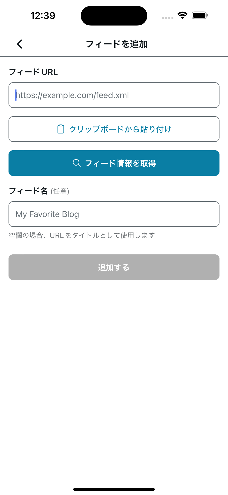
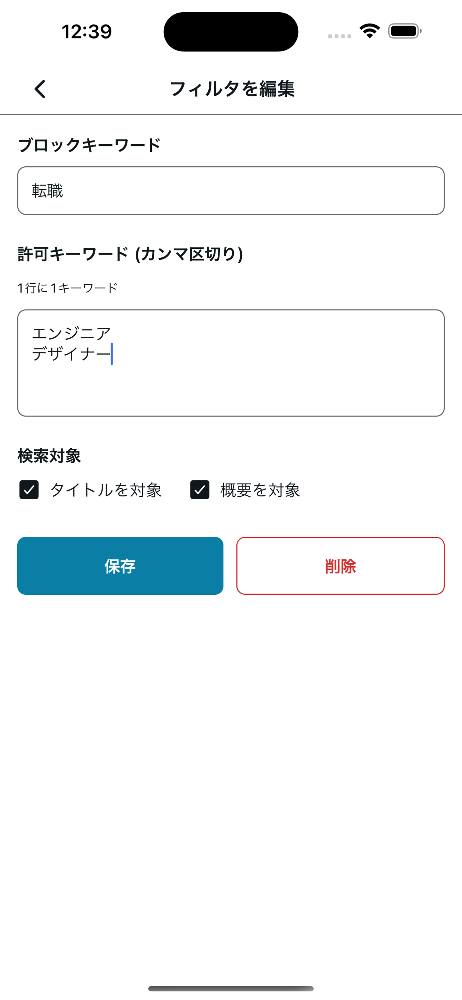
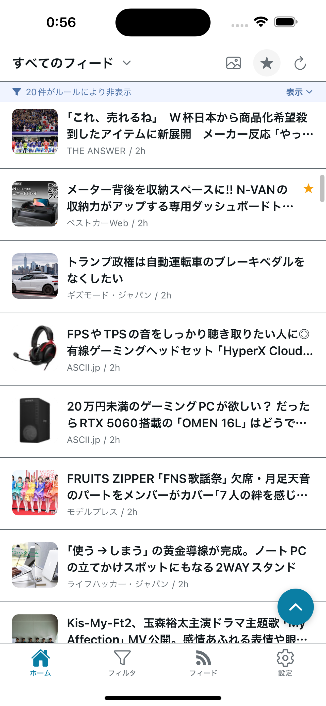

  

<h1 align="center">Filto</h1>

  見たくない話題は、見ない。ローカルフィルタ特化型の軽量RSSリーダー

  <a href="README_EN.md">English</a> | 日本語

  
  &nbsp;
  

---

## 概要

Filto（フィルト）は、好きな情報源だけを集めて、不要な話題をキーワードで非表示にできるシンプルなRSSリーダーです。おすすめアルゴリズムに支配されず、自分で選んだ情報だけを、自分のルールで読めます。

多くのRSSリーダーは「情報を集める」ことが中心です。Filtoは「不要な情報を減らす」ことを中心に設計しています。Filto は次の3点を重視しています。

- **記事の取得・判定はすべてローカル**（クラウド非依存・アカウント登録不要）
- **シンプルだが表現力のあるフィルタ**
- **通知に追われず、自分のタイミングで読む静かな体験**

---

## 想定ユーザー

- RSSを日常的に使っているが、ノイズに疲れている人
- 多種多様な情報を自分なりに取捨選択したい人
- 有料フィルタ（Inoreader / Feedly など）に価値は感じるが、課金には慎重な人
- 「読む体験」を自分で設計したいエンジニア・個人開発者
- おすすめアルゴリズムなんてクソ喰らえと思っているロックな人

---

## 主な特徴

- **見たくない話題をキーワードで非表示** — ブロックキーワードで記事を除外
- **見たい話題は残せる** — 許可キーワードで例外を設定（例：「スポーツ」は非表示だけど、「F1」だけは表示）
- **グローバル許可キーワード** — すべてのフィルタより優先して表示させる許可キーワード
- **好きな情報源だけをまとめる** — RSS / Atom フィードを追加・削除・並び替え
- フィルタは即時・オンデマンドで反映
- お気に入り保存 / 表示レイアウト切り替え / 記事の保持期間設定
- ライト / ダークテーマ、日本語 / 英語RSSに対応

---

## 使い方

  
  &nbsp;
  
  &nbsp;
  

1. **情報源を追加** — 読みたい RSS / Atom フィードを登録します（アカウント登録は不要）。
2. **フィルタを設定** — 見たくないキーワードをブロック。例外として残したいキーワードも指定できます（例：「転職」は非表示だけど、「エンジニア」「デザイナー」が含まれていれば表示する）。
3. **記事を読む** — 自分のルールで絞り込まれた記事だけが並びます。記事本文は規定ブラウザで開きます。

---

## 技術スタック

- **フロントエンド**: React Native（Expo）
- **言語**: TypeScript
- **ローカルDB**: SQLite
- **アーキテクチャ**: UI / Service / Repository
- **通信**: RSS取得のみ（クラウド依存なし）

開発方針・命名規則・ドキュメント構成は [CONTRIBUTING.md](CONTRIBUTING.md) を参照してください。

---

## 開発状況

- 個人開発プロジェクト
- **現在 App Store / Google Play にて公開中（v1.2.0）** — [App Store](https://apps.apple.com/jp/app/filto/id6763070121) ／ [Google Play](https://play.google.com/store/apps/details?id=com.yskms.filto)

※ 今後もローカルファースト・シンプルな思想を維持しながら改善を続けます。

---

## ライセンス

MIT License
