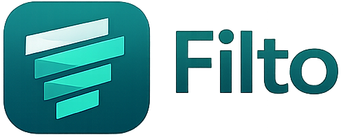
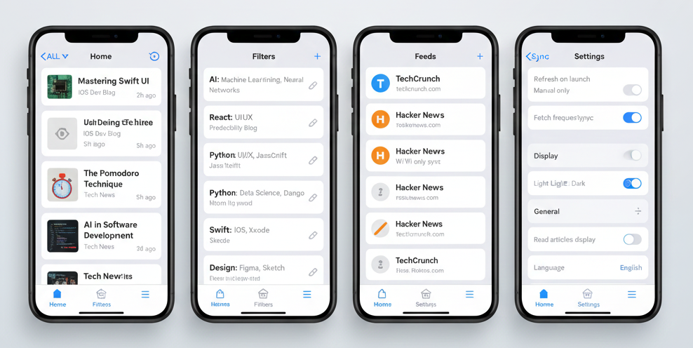

<p align="center">
  
</p>

<h1 align="center">Filto</h1>

<p align="center">
  Simple RSS Reader with Powerful Filters
</p>

<p align="center">
  <a href="README_EN.md">English</a> | 日本語
</p>

<p align="center">
  <a href="https://apps.apple.com/jp/app/filto/id6763070121"></a>
  &nbsp;
  <a href="https://play.google.com/store/apps/details?id=com.yskms.filto"></a>
</p>

**ローカルフィルタ特化型の軽量RSSリーダー**

Filto は、**記事のノイズを「自分のルール」でコントロールできる**シンプルで実用的なモバイル向けRSSリーダーです。

---

## 概要

多くのRSSリーダーでは、

- 高度なフィルタは有料プラン限定
- クラウド側での処理が前提
- 設定が複雑で疲れる

といった課題があります。

Filto では、

- **記事取得・判定はすべてローカル**
- **シンプルだが表現力のあるフィルタ**
- **通知に依存しない静かな体験**

を重視し、「必要な記事だけを気持ちよく読む」ことを目的としています。

---

## 想定ユーザー

- RSSを日常的に使っているが、ノイズに疲れている人
- 技術 / 投資 / 趣味系の情報を自分なりに取捨選択したい人
- Inoreader / Feedly などの有料フィルタに価値は感じるが、課金には慎重な人
- 「読む体験」を自分で設計したいエンジニア・個人開発者

---

## 主な特徴

- RSSフィード管理（追加・削除・並び替え）
- ローカルフィルタ機能
  - キーワードによるブロック / 許可
  - 例外ルール（例：Aを含むがBも含む場合は許可）
  - グローバル許可リスト（すべてのフィルタより優先して許可）
- フィルタは即時反映・オンデマンド
- 記事本文はシステムブラウザで表示
- 手動または低頻度のフィード更新
- ライト / ダークテーマ対応
- 日本語 / 英語RSSの両対応（UI多言語化予定）

---

## 技術スタック

- **フロントエンド**: React Native（Expo）
- **言語**: TypeScript
- **ローカルDB**: SQLite
- **アーキテクチャ**: UI / Service / Repository
- **通信**: RSS取得のみ（クラウド依存なし）

---

## プロジェクト構成（簡易）

```txt
FILTO-APP/
├─ filto/          # アプリ本体（Expo + React Native）
│  ├─ app/         # UI / Screens（Expo Router）
│  ├─ components/  # 共通UIコンポーネント
│  ├─ hooks/       # カスタムフック
│  ├─ constants/   # テーマなどの定数
│  └─ ...          # その他アプリ関連コード
└─ docs/           # 設計ドキュメント一式
```

---

## ドキュメント

- **要件定義**: [00_main_spec.md](docs/01_requirements/00_main_spec.md) - アプリ全体の仕様
- **開発計画**: [01_wbs.md](docs/03_dev_plan/01_wbs.md) - 開発スケジュール
- **基本設計**: [02_basic_design/](docs/02_basic_design/) - 画面遷移図・DB設計・API設計など
- **詳細設計**: [04_detail_design/](docs/04_detail_design/) - 各画面の詳細仕様
- **Cursor指示書**: [cursor/](docs/cursor/) - Cursor向け実装用プロンプト

詳細は [00_main_spec.md](docs/01_requirements/00_main_spec.md) の「ドキュメント構成」を参照

---

## 開発ルール

### コミットメッセージ規約
- `feat`: 新機能・画面追加
- `fix`: バグ修正
- `refactor`: 挙動を変えない内部整理
- `docs`: 設計書・README修正
- `chore`: 設定・雑務（機能影響なし）

#### 方針
- 1コミット = 1意図
- UIのみでも feat とする
- 迷ったら feat を使う

---

## 命名規則

### ファイル名

| 種類 | 命名規則 | 例 |
|------|---------|-----|
| **画面** | snake_case.tsx | `filter_edit.tsx`, `feed_add.tsx` |
| **コンポーネント** | PascalCase.tsx | `FilterItem.tsx`, `Header.tsx` |
| **サービス** | PascalCase.ts | `FilterService.ts`, `FeedService.ts` |
| **リポジトリ** | PascalCase.ts | `FilterRepository.ts`, `FeedRepository.ts` |
| **ユーティリティ** | camelCase.ts | `dateUtils.ts`, `stringUtils.ts` |
| **型定義** | PascalCase.ts | `Filter.ts`, `Feed.ts` |

### 変数・関数名

| 種類 | 命名規則 | 例 |
|------|---------|-----|
| **変数** | camelCase | `filterList`, `isLoading` |
| **関数** | camelCase | `handleSave()`, `fetchData()` |
| **クラス** | PascalCase | `FilterService`, `DatabaseManager` |
| **定数** | UPPER_SNAKE_CASE | `MAX_FILTERS`, `API_URL` |

### ディレクトリ構造
```
docs/
filto/
├─ app/                    # 画面（snake_case）
├─ components/             # コンポーネント（PascalCase）
├─ services/               # サービス（PascalCase）
├─ repositories/           # リポジトリ（PascalCase）
├─ utils/                  # ユーティリティ（camelCase）
├─ types/                  # 型定義（PascalCase）
└─ constants/              # 定数（UPPER_SNAKE_CASE）
```

### データベース（SQLite）

- **テーブル名**: snake_case (`filters`, `global_allow_keywords`)
- **カラム名**: snake_case (`block_keyword`, `created_at`)

---

## UI Mock (Concept)



※ 本画像は初期検討用のUIイメージです

---

## 開発状況

- **個人開発プロジェクト**
- **iOS / Android とも公開中**（v1.2.0）
  - [App Store](https://apps.apple.com/jp/app/filto/id6763070121) ／ [Google Play](https://play.google.com/store/apps/details?id=com.yskms.filto)

※ 課金機能は現時点で未実装ですが、将来的な追加を前提とした設計になっています。

---

## ライセンス

MIT License