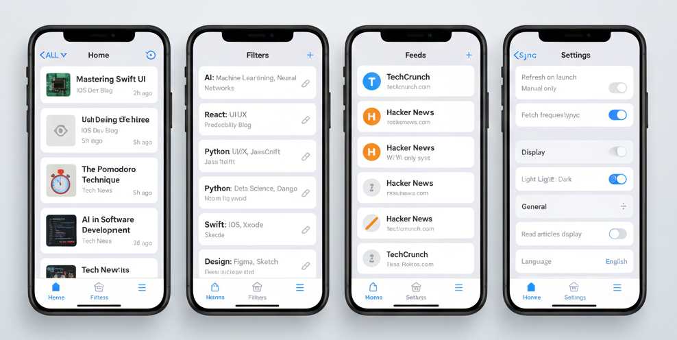

<p align="center">
  
</p>

<h1 align="center">Filto</h1>

<p align="center">
  Simple RSS Reader with Powerful Filters
</p>

---

# Filto

**Lightweight RSS Reader with Local Filter Focus**

Filto is a simple and practical mobile RSS reader that lets you **control article noise with your own rules**.

---

## Overview

Many RSS readers face challenges such as:

- Advanced filters are limited to paid plans
- Processing relies on cloud services
- Complex settings can be overwhelming

Filto focuses on:

- **All article fetching and filtering is done locally**
- **Simple yet expressive filters**
- **Quiet experience without push notifications**

The goal is to "read only the articles you need, comfortably."

---

## Target Users

- People who use RSS daily but are tired of noise
- Those who want to curate tech/investment/hobby information their own way
- Users who see value in premium filters (like Inoreader/Feedly) but are cautious about subscriptions
- Engineers and indie developers who want to design their own reading experience

---

## Key Features

- RSS feed management (add, delete, reorder)
- Local filtering capabilities
  - Block/allow by keywords
  - Exception rules (e.g., allow if contains A but also contains B)
  - Global allow list (prioritized over all filters)
- Filters apply instantly and on-demand
- Article content opens in system browser
- Manual or low-frequency feed updates
- Light/Dark theme support
- Support for Japanese/English RSS feeds (UI localization planned)

---

## Tech Stack

- **Frontend**: React Native (Expo)
- **Language**: TypeScript
- **Local DB**: SQLite
- **Architecture**: UI / Service / Repository
- **Communication**: RSS fetching only (no cloud dependencies)

---

## Project Structure (Simplified)

```txt
FILTO-APP/
├─ filto/          # Main app (Expo + React Native)
│  ├─ app/         # UI / Screens (Expo Router)
│  ├─ components/  # Shared UI components
│  ├─ hooks/       # Custom hooks
│  ├─ constants/   # Constants like theme
│  └─ ...          # Other app-related code
└─ docs/           # Design documentation
```

---

## Documentation

- **Requirements**: [00_main_spec.md](docs/01_requirements/00_main_spec.md) - Overall specifications
- **Dev Plan**: [01_wbs.md](docs/03_dev_plan/01_wbs.md) - Development schedule
- **Basic Design**: [02_basic_design/](docs/02_basic_design/) - Screen flows, DB design, API design, etc.
- **Detailed Design**: [04_detail_design/](docs/04_detail_design/) - Detailed specs for each screen
- **Cursor Guides**: [cursor/](docs/cursor/) - Implementation prompts for Cursor

For complete documentation structure, see [00_main_spec.md](docs/01_requirements/00_main_spec.md)

---

## Development Rules

### Commit Message Convention
- `feat`: New features/screens
- `fix`: Bug fixes
- `refactor`: Internal improvements without behavior changes
- `docs`: Design docs/README updates
- `chore`: Config/maintenance (no functional impact)

#### Guidelines
- 1 commit = 1 intent
- UI-only changes also use `feat`
- When in doubt, use `feat`

---

## UI Mock (Concept)



*This image is an initial UI concept for design exploration

---

## Development Status

- **Personal development project**
- **Current**: Design to implementation phase
- **Initial release target**: May 2026

*Monetization features are not included in the initial release but are planned for future updates.

---

## License

MIT License