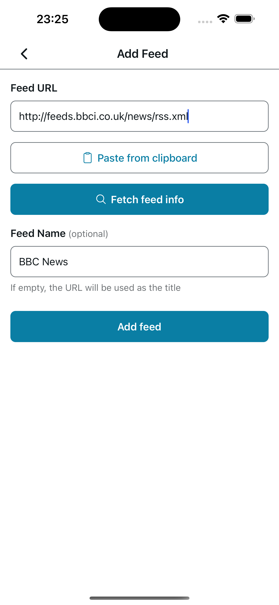
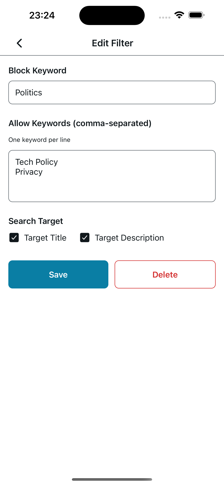
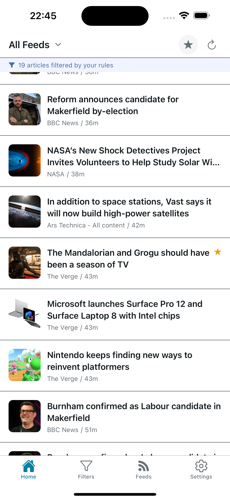

  

<h1 align="center">Filto</h1>

  See what you want. Hide what you don't. 
  A lightweight RSS reader focused on local filtering.

  English | <a href="README.md">日本語</a>

  
  &nbsp;
  

---

## Overview

Filto is a simple RSS reader that lets you collect only the sources you trust and hide unwanted topics using keyword filters.

Instead of relying on recommendation algorithms, you decide what deserves your attention. Your feed, your rules.

Many RSS readers focus on collecting information, but filtering out noise is often locked behind paid plans, cloud services, or overly complex rule systems.

Filto is built around three core ideas:

* **Everything runs locally** — no cloud processing, no account required.
* **Powerful filtering without unnecessary complexity.**
* **A quiet reading experience without notification overload.**

---

## Who is it for?

* People who already use RSS but are tired of noisy feeds.
* Anyone who wants complete control over what they read.
* Users who like premium filtering features in Feedly or Inoreader, but prefer a lightweight local solution.
* Developers and makers who want to design their own reading experience.
* People who think recommendation algorithms can go to hell.

---

## Features

* **Hide unwanted topics** using block keywords.
* **Keep exceptions** with allow keywords (e.g. hide "Sports", but still show articles about "F1").
* **Global allow list** that always takes priority over filters.
* **Add, remove, and organize** RSS / Atom feeds.
* Filters are applied instantly on demand.
* Favorites, multiple layouts, configurable article retention.
* Light & dark themes.
* Supports both English and Japanese RSS feeds.

---

## How it works

  
  &nbsp;
  
  &nbsp;
  

1. **Add your favorite feeds** — RSS and Atom are supported. No account required.
2. **Create your filters** — Block topics you don't want to see, while allowing specific exceptions.
3. **Enjoy a cleaner feed** — Only articles that match your own rules are shown. Articles open in your default browser.

---

## Tech Stack

* **Frontend:** React Native (Expo)
* **Language:** TypeScript
* **Local Database:** SQLite
* **Architecture:** UI / Service / Repository
* **Network:** RSS fetching only (no cloud backend)

For development guidelines and project structure, see [CONTRIBUTING.md](CONTRIBUTING.md).

---

## Project Status

* Personal project
* **Available on both iOS and Android** (v1.2.0)

App Store: https://apps.apple.com/app/filto/id6763070121

Google Play: https://play.google.com/store/apps/details?id=com.yskms.filto

> Monetization is not implemented yet, but the app is designed with future premium features in mind.

---

## License

MIT License
