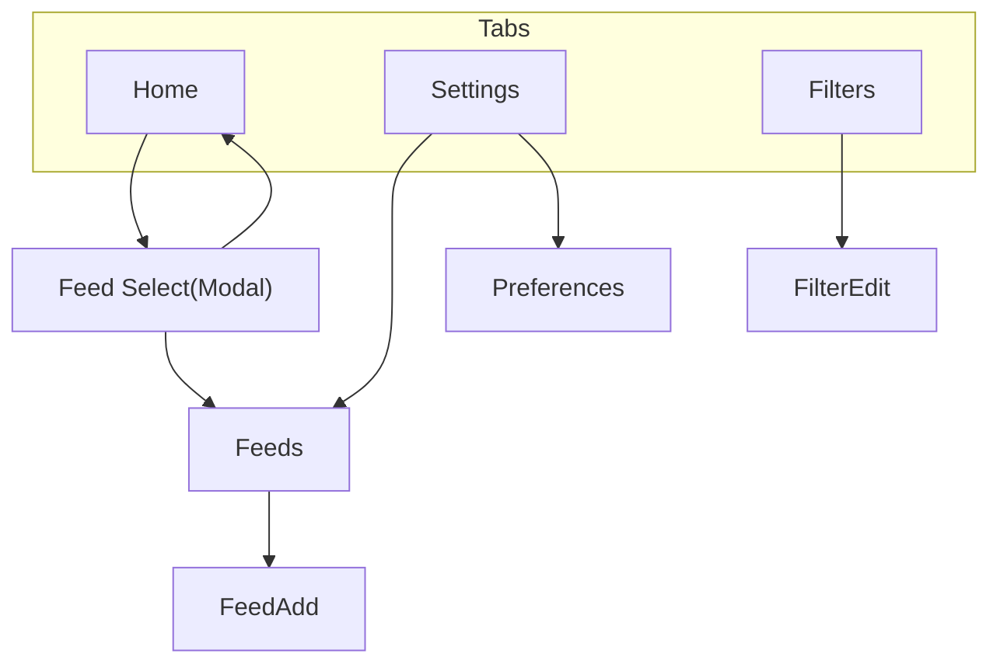

# 画面遷移図

## 遷移イメージ



---

## 画面ノード

- **Home**：記事一覧
- **Feed Select**：表示フィード選択（モーダル）
- **Filters**：フィルタ一覧
- **FilterEdit**：フィルタ追加/編集
- **Feeds**：フィード一覧
- **FeedAdd**：RSSフィード追加/編集
- **Settings**：設定
- **Preferences**：表示・同期・その他

---

## タブ構成

```
[ Home ][ Filters ][ Settings ]
```

- 常に下部タブで相互遷移可能
- Home ⇄ Filters ⇄ Settings は自由に行き来

---

## 遷移ルール

### 🏠 Home

- フィード名タップ → Feed Select（モーダル）
- 記事タップ → 外部ブラウザ（アプリ外）

---

### ⚙ Settings

**Settingsトップから：**

| タップ | 遷移先 |
|--------|--------|
| Feeds | → Feeds |
| Preferences | → Preferences |

---

### 📚 Feeds

- **＋** → FeedAdd
- **← 戻る** → Settings

---

### ➕ FeedAdd

- **追加成功** → Feeds に戻る
- **←** → Feeds

---

### 🚫 Filters

- **＋** → FilterEdit（新規）
- **✏️** → FilterEdit（編集）
- **← 戻る** → Settings

---

### ✏️ FilterEdit

- **保存** → Filters
- **←** → Filters

---

### ⚙ Preferences

- **←** → Settings
