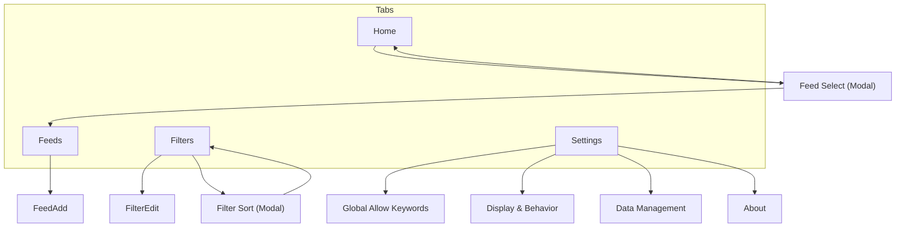

# 画面遷移図

## 遷移イメージ



---

## 画面ノード

- **Home**：記事一覧
- **Feed Select**：表示フィード選択（モーダル）
- **Filters**：フィルタ一覧
- **Filter Sort**：フィルタ並び替え選択（モーダル）
- **FilterEdit**：フィルタ追加/編集
- **Feeds**：フィード一覧
- **FeedAdd**：RSSフィード追加/編集
- **Settings**：設定
- **Display & Behavior**：表示・挙動（既読表示/テーマ/言語/起動時更新）
- **Data Management**：データ管理（保持期間/手動削除/WiFi取得/更新間隔等）
- **About**：バージョン・アプリ情報
- **Global Allow Keywords**：グローバル許可キーワード管理

---

## タブ構成

```
[ Home ][ Filters ][ Feeds ][ Settings ]
```

- 常に下部タブで相互遷移可能
- Home ⇄ Filters ⇄ Feeds ⇄ Settings は自由に行き来

### タブグループ内の画面

**ボトムタブ表示あり**（タブグループ内、`app/(tabs)/`配下）:
- **Home** (`app/(tabs)/index.tsx`) - タブバーに表示
- **Filters** (`app/(tabs)/filters.tsx`) - タブバーに表示
- **Feeds** (`app/(tabs)/feeds.tsx`) - タブバーに表示
- **Settings** (`app/(tabs)/settings.tsx`) - タブバーに表示

**ボトムタブ表示なし**（タブグループ外、`app/`直下）:
- **FeedAdd** (`app/feed_add.tsx`) - フィード追加・編集画面
- **FilterEdit** (`app/filter_edit.tsx`) - フィルタ追加・編集画面
- **Display & Behavior** (`app/display_behavior.tsx`) - 表示・挙動設定
- **Data Management** (`app/data_management.tsx`) - データ管理設定
- **About** (`app/about.tsx`) - アプリ情報
- **Global Allow Keywords** (`app/global_allow_keywords.tsx`) - グローバル許可キーワード管理画面

**実装メモ**: 
- `app/(tabs)/`配下: ボトムタブバー表示（4タブ）
- `app/`直下: ボトムタブバー非表示
  - `<Stack.Screen options={{ headerShown: false }} />`でデフォルトヘッダーを非表示
  - 独自ヘッダーを実装（2重ヘッダー防止）

---

## 遷移ルール

### 🏠 Home

- フィード名タップ → Feed Select（モーダル）
- 記事タップ → 外部ブラウザ（アプリ外）

---

### 🚫 Filters

- **🔄ボタン** → Filter Sort（モーダル）
- **＋ボタン** → FilterEdit（新規）
- **✏️ボタン** → FilterEdit（編集）

---

### 🔄 Filter Sort（モーダル）

- **並び順選択** → Filtersに戻る（自動的に並び替え反映）
- **モーダル外タップ** → 閉じる

**選択肢**：
- ブロックキーワード（昇順）
- 作成日時（新しい順）
- 作成日時（古い順）
- 更新日時（新しい順）
- 更新日時（古い順）

---

### ✏️ FilterEdit

- **保存** → Filters
- **削除**（編集時のみ） → Filters
- **←** → Filters

---

### ⚙ Settings

**Settingsトップから：**

| タップ | 遷移先 |
|--------|--------|
| 📚 Global Allow Keywords | → Global Allow Keywords |
| 👁 Display & Behavior | → Display & Behavior |
| 💾 Data Management | → Data Management |
| ⭐ Pro | （無効） |
| ℹ About | → About |

※ Feeds はボトムタブから直接アクセスする。Settings からのリンクはなし。

---

### 📚 Feeds

- **＋** → FeedAdd
- **ボトムタブ** → Home / Filters / Feeds / Settings に自由に遷移可能

**注意**: Feeds は4つのボトムタブのひとつ。タブで他画面へ切り替える。Settings からの遷移はない。

---

### ➕ FeedAdd

- **追加成功** → Feeds に戻る
- **←** → Feeds

---

### 👁 Display & Behavior

- **既読の表示方法**（dim / hide）、**テーマ**（Light / Dark / System）、**言語**（日本語 / English）、**起動時の挙動**（自動更新 ON/OFF）
- **←** → Settings

### 💾 Data Management

- **記事保持期間**（7日/30日/90日/無制限）、**手動削除オプション**、**WiFi時のみ取得**、**最低更新間隔**、（将来）OPML Import/Export・バックアップ/復元
- **←** → Settings

### ℹ About

- アプリ名・バージョン等
- **←** → Settings

---

### 🌟 Global Allow Keywords

- **＋ボタン** → キーワード追加（Pro版チェックあり）
- **✕ボタン** → キーワード削除（確認ダイアログ）
- **Pro版ボタン**（無料版のみ） → Pro案内画面
- **←** → Settings