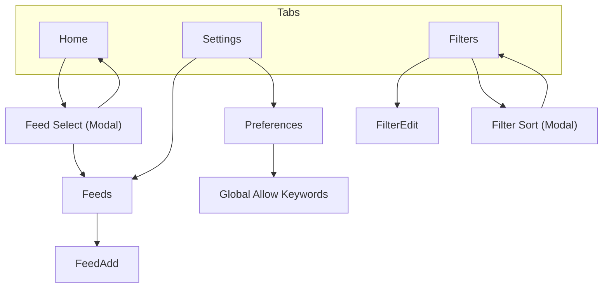

# 画面遷移図

## 遷移イメージ



---

## 画面ノード

- **Home**：記事一覧
- **Feed Select**：表示フィード選択（モーダル）
- **Filters**：フィルタ一覧
- **Filter Sort**：フィルタ並び替え選択（モーダル）
- **FilterEdit**：フィルタ追加/編集
- **Feeds**：フィード一覧
- **FeedAdd**：RSSフィード追加/編集
- **Settings**：設定
- **Preferences**：表示・同期・その他
- **Global Allow Keywords**：グローバル許可キーワード管理

---

## タブ構成

```
[ Home ][ Filters ][ Settings ]
```

- 常に下部タブで相互遷移可能
- Home ⇄ Filters ⇄ Settings は自由に行き来

---

## 遷移ルール

### 🏠 Home

- フィード名タップ → Feed Select（モーダル）
- 記事タップ → 外部ブラウザ（アプリ外）

---

### 🚫 Filters

- **🔄ボタン** → Filter Sort（モーダル）
- **＋ボタン** → FilterEdit（新規）
- **✏️ボタン** → FilterEdit（編集）

---

### 🔄 Filter Sort（モーダル）

- **並び順選択** → Filtersに戻る（自動的に並び替え反映）
- **モーダル外タップ** → 閉じる

**選択肢**：
- ブロックキーワード（昇順）
- 作成日時（新しい順）
- 作成日時（古い順）
- 更新日時（新しい順）
- 更新日時（古い順）

---

### ✏️ FilterEdit

- **保存** → Filters
- **削除**（編集時のみ） → Filters
- **←** → Filters

---

### ⚙ Settings

**Settingsトップから：**

| タップ | 遷移先 |
|--------|--------|
| Feeds | → Feeds |
| Preferences | → Preferences |

---

### 📚 Feeds

- **＋** → FeedAdd
- **← 戻る** → Settings

---

### ➕ FeedAdd

- **追加成功** → Feeds に戻る
- **←** → Feeds

---

### ⚙ Preferences

- **グローバル許可** → Global Allow Keywords
- **←** → Settings

---

### 🌟 Global Allow Keywords

- **＋ボタン** → キーワード追加（Pro版チェックあり）
- **✕ボタン** → キーワード削除（確認ダイアログ）
- **Pro版ボタン**（無料版のみ） → Pro案内画面
- **←** → Preferences