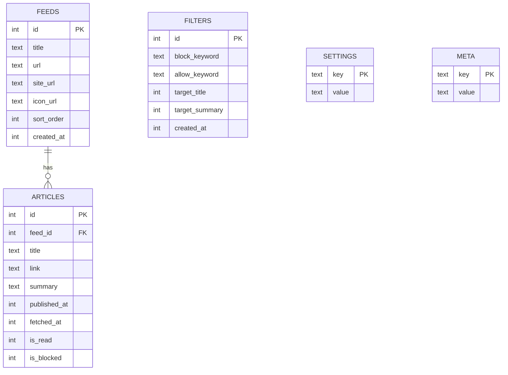

# ER図（Mermaid）

```mermaid
erDiagram

    FEEDS {
        int     id PK
        text    title
        text    url
        text    site_url
        text    icon_url
        int     sort_order
        int     created_at
    }

    ARTICLES {
        int     id PK
        int     feed_id FK
        text    title
        text    link
        text    summary
        int     published_at
        int     fetched_at
        int     is_read
        int     is_blocked
    }

    FILTERS {
        int     id PK
        text    block_keyword
        text    allow_keyword
        int     target_title
        int     target_summary
        int     created_at
    }

    SETTINGS {
        text    key PK
        text    value
    }

    META {
        text    key PK
        text    value
    }

    FEEDS ||--o{ ARTICLES : has
```

---

## 補足

- `FEEDS ||--o{ ARTICLES`  
  → 1つのフィードに複数記事（1:N）

- `FILTERS`, `SETTINGS`, `META` は他テーブルとFK関係を持たない「独立テーブル」として表現

- `feed_id` が `ARTICLES` → `FEEDS.id` の外部キー
