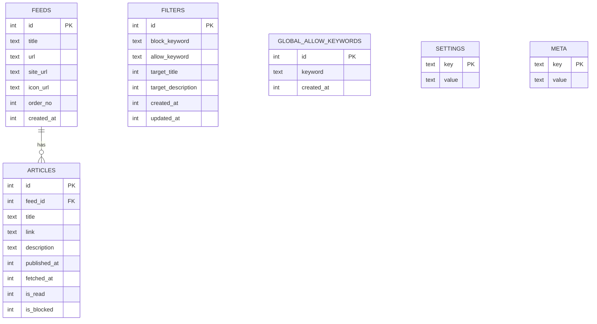

# ER図（Mermaid）



---

## 補足

### リレーション
- `FEEDS ||--o{ ARTICLES`  
  → 1つのフィードに複数記事（1:N）
  → `feed_id` が `ARTICLES` → `FEEDS.id` の外部キー
  → ON DELETE CASCADE（フィード削除時に記事も削除）

### 独立テーブル（FK関係なし）
- `FILTERS` - 記事評価時に参照（論理的な関係）
- `GLOBAL_ALLOW_KEYWORDS` - 記事評価時に最優先で参照（論理的な関係）
- `SETTINGS` - アプリ全体の設定
- `META` - アプリ全体のメタ情報

### フィルタ評価の流れ（論理的な関係）

```
記事評価時:
1. GLOBAL_ALLOW_KEYWORDS をチェック（最優先）
   → ヒットしたら無条件で許可
2. FILTERS を順次評価
   → block_keyword + allow_keyword で判定
3. ARTICLES.is_blocked を更新
```

### 主な変更点（従来版から）

#### テーブル追加
- ✅ `GLOBAL_ALLOW_KEYWORDS` - グローバル許可リスト（新規）

#### カラム変更
- `FEEDS.sort_order` → `order_no`
- `ARTICLES.summary` → `description`
- `FILTERS.target_summary` → `target_description`
- `FILTERS` に `updated_at` を追加

#### インデックス追加
- `ARTICLES.is_blocked` - Home画面での絞り込み用
- `GLOBAL_ALLOW_KEYWORDS.keyword` - 検索高速化

### Pro版制限

#### フィルタ数
```sql
SELECT COUNT(*) FROM FILTERS;
-- 無料版: 100件まで
-- Pro版: 無制限
```

#### グローバル許可キーワード数
```sql
SELECT COUNT(*) FROM GLOBAL_ALLOW_KEYWORDS;
-- 無料版: 3件まで
-- Pro版: 無制限
```

### 将来拡張の余地

#### ARTICLES
- `is_star` - お気に入り
- `memo` - メモ

#### FILTERS
- `is_enabled` - 有効/無効
- `order_no` - 並び替え

#### GLOBAL_ALLOW_KEYWORDS
- `priority` - 優先度
- `category` - カテゴリ