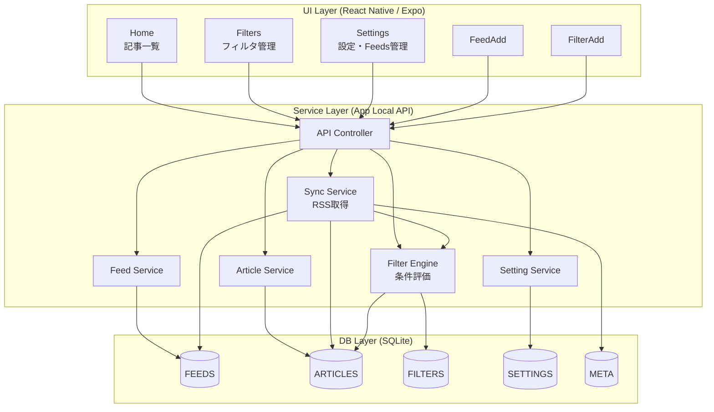

# 🏗 アーキテクチャ図（Mermaid）



---

## 🧩 各レイヤの役割

### 🎨 UI Layer

**React Native / Expo**

- **Home**：記事取得・既読更新・手動更新
- **Filters**：CRUD
- **Settings**：設定 + Feeds管理
- APIを叩くだけで、ビジネスロジックは持たない

👉 将来 Web / Tablet UI にしても差し替え可能

---

### ⚙ Service Layer（アプリ内API）

**Controller + UseCase群**

- **`API Controller`**
  - UIからのリクエスト窓口

- **`Sync Service`**
  - RSS取得
  - 記事保存
  - META更新
  - Filter再評価呼び出し

- **`Filter Engine`**
  - block/allow条件評価

- **`Feed / Article / Setting Service`**
  - 各テーブルのCRUD

👉 将来ここを FastAPI等でサーバ化しても構造を保てる

---

### 🗄 DB Layer

**SQLite（ローカル）**

- FEEDS
- ARTICLES
- FILTERS
- SETTINGS
- META

👉 将来 Realm / PostgreSQL / Cloud に変更しても Service層が吸収

---

## 🔄 代表フロー：Homeで「更新」押下

```
Home UI
 → POST /api/sync
   → API Controller
     → Sync Service
        → RSS取得
        → ARTICLES保存
        → META更新
        → Filter Engineで評価
           → ARTICLES.is_blocked更新
 → 結果返却
 → Home 再表示
```

---

## ✅ この構成のメリット

- **UI / ロジック / DB が疎結合**
- **ローカル完結でも API設計がそのまま活きる**
- **後から追加しやすい**：
  - クラウド同期
  - Pro課金
  - Web版
- **テストも Service層単体で可能**
