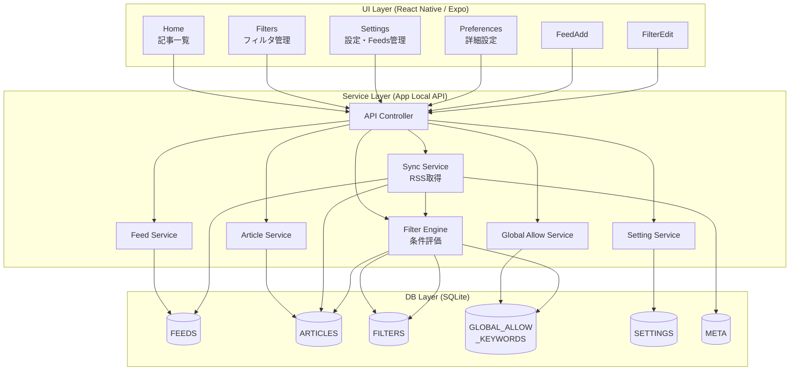

# 🏗 アーキテクチャ図（Mermaid）



---

## 🧩 各レイヤの役割

### 🎨 UI Layer

**React Native / Expo**

- **Home**：記事取得・既読更新・手動更新
- **Filters**：フィルタCRUD・並び替え
- **Settings**：設定トップ + Feeds管理
- **Preferences**：詳細設定 + グローバル許可リスト管理
- **FeedAdd / FilterEdit**：追加・編集画面

APIを叩くだけで、ビジネスロジックは持たない

👉 将来 Web / Tablet UI にしても差し替え可能

---

### ⚙ Service Layer（アプリ内API）

**Controller + UseCase群**

#### **API Controller**
- UIからのリクエスト窓口
- 各Serviceへのルーティング
- Pro版制限のチェック

#### **Sync Service**
- RSS取得（各フィードから）
- 記事保存（ARTICLES）
- META更新（last_fetch_at）
- Filter再評価呼び出し

#### **Filter Engine**
- フィルタ評価ロジック
- グローバル許可リストを最優先でチェック
- block/allow条件評価
- is_blocked 更新

評価フロー：
```
1. グローバル許可リストチェック（最優先）
   → ヒット: 無条件で許可
   → 不一致: 次へ

2. 通常のフィルタ評価
   - block_keyword チェック
   - allow_keyword チェック（例外処理）

3. is_blocked 更新
```

#### **Feed / Article / Setting Service**
- 各テーブルのCRUD

#### **Global Allow Service**（新規）
- グローバル許可キーワードのCRUD
- Pro版制限チェック（無料3件、Pro無制限）
- キャッシュ管理（起動時読み込み）

👉 将来ここを FastAPI等でサーバ化しても構造を保てる

---

### 🗄 DB Layer

**SQLite（ローカル）**

| テーブル | 役割 |
|---------|------|
| FEEDS | RSSフィード管理 |
| ARTICLES | 記事データ |
| FILTERS | フィルタ条件 |
| **GLOBAL_ALLOW_KEYWORDS** | **グローバル許可リスト**（新規） |
| SETTINGS | アプリ設定（Key-Value） |
| META | メタ情報 |

👉 将来 Realm / PostgreSQL / Cloud に変更しても Service層が吸収

---

## 🔄 代表フロー

### 1. Homeで「更新」押下

```
Home UI
 → POST /api/sync
   → API Controller
     → Sync Service
        1. RSS取得（各フィード）
        2. ARTICLES保存
        3. META更新
        4. Filter Engine呼び出し
           → Global Allow Service: キーワード取得（キャッシュ）
           → グローバル許可リストチェック
           → 通常のフィルタ評価
           → ARTICLES.is_blocked更新
 → 結果返却
 → Home 再表示（is_blocked=0のみ）
```

---

### 2. グローバル許可キーワード追加

```
Preferences UI
 → POST /api/global-allow-keywords { keyword: "React" }
   → API Controller
     → Global Allow Service
        1. Pro版チェック（無料3件制限）
        2. GLOBAL_ALLOW_KEYWORDS に INSERT
        3. キャッシュクリア
        4. Filter Engine呼び出し（全記事再評価）
           → グローバル許可リストを再取得
           → 全記事を再評価
           → is_blocked 更新
 → 結果返却
 → Preferences 再表示
```

---

### 3. フィルタ追加

```
FilterEdit UI
 → POST /api/filters { block_keyword: "JavaScript", ... }
   → API Controller
     → Filter Service
        1. Pro版チェック（無料100件制限）
        2. FILTERS に INSERT
        3. Filter Engine呼び出し（全記事再評価）
           → グローバル許可リスト取得（キャッシュ）
           → 全記事を再評価
           → is_blocked 更新
 → 結果返却
 → Filters画面に戻る
```

---

## 🌟 グローバル許可リストの仕組み

### キャッシュ戦略

```typescript
// Global Allow Service（擬似コード）
class GlobalAllowService {
  private cache: string[] | null = null;

  // キャッシュから取得（高速）
  async getKeywords(): Promise<string[]> {
    if (this.cache === null) {
      this.cache = await this.repository.list();
    }
    return this.cache;
  }

  // 追加時：キャッシュクリア + 再評価
  async add(keyword: string): Promise<void> {
    await this.repository.add(keyword);
    this.clearCache();
    await FilterEngine.evaluateAll(); // 全記事再評価
  }

  // 削除時：キャッシュクリア + 再評価
  async delete(keyword: string): Promise<void> {
    await this.repository.delete(keyword);
    this.clearCache();
    await FilterEngine.evaluateAll(); // 全記事再評価
  }

  clearCache(): void {
    this.cache = null;
  }
}
```

### フィルタ評価での使用

```typescript
// Filter Engine（擬似コード）
class FilterEngine {
  async evaluateArticle(article: Article): Promise<boolean> {
    // 1. グローバル許可リストを取得（キャッシュから）
    const globalAllowKeywords = await GlobalAllowService.getKeywords();

    // 2. グローバル許可リストチェック（最優先）
    if (this.matchesAny(article, globalAllowKeywords)) {
      return false; // is_blocked = false（許可）
    }

    // 3. 通常のフィルタ評価
    const filters = await FilterService.list();
    for (const filter of filters) {
      if (this.matches(article, filter.block_keyword)) {
        if (filter.allow_keyword) {
          const allowKeywords = filter.allow_keyword.split(',');
          if (this.matchesAny(article, allowKeywords)) {
            continue; // 例外として許可
          }
        }
        return true; // is_blocked = true（ブロック）
      }
    }

    return false; // is_blocked = false（表示）
  }
}
```

---

## ✅ この構成のメリット

### 疎結合
- **UI / ロジック / DB が疎結合**
- グローバル許可リストを追加しても各レイヤへの影響が最小

### ローカル完結
- **API設計がそのまま活きる**
- ローカルでもRESTful APIの恩恵

### 拡張性
- **後から追加しやすい**：
  - クラウド同期
  - Pro課金
  - Web版
  - グローバル許可リストの優先度機能
  - 正規表現フィルタ（Pro版）

### テスタビリティ
- **Service層単体でテスト可能**
- Filter Engineの評価ロジックを独立してテスト

### パフォーマンス
- **グローバル許可リストのキャッシュ**
  - 起動時に1回読み込み
  - メモリに保持
  - 変更時のみ再読み込み
- **バッチ処理**
  - フィルタ再評価は一括処理
  - SQLのバッチ更新

---

## 🔮 将来の拡張例

### Pro版機能
```
/api/pro/status
/api/pro/purchase
/api/pro/restore
```

### クラウド同期
```
/api/cloud/sync
/api/cloud/backup
/api/cloud/restore
```

### OPML対応
```
/api/export/opml
/api/import/opml
```

### 高度なフィルタ
```
POST /api/filters
{
  "block_keyword": "^[0-9]{2}新卒$",
  "regex": true,  // Pro版限定
  "priority": 10
}
```

### グローバル許可リストの拡張
```
POST /api/global-allow-keywords
{
  "keyword": "React",
  "priority": 10,     // 優先度
  "category": "tech"  // カテゴリ
}
```

---

## 📊 パフォーマンス指標

### 目標値
- **起動時間**: 2秒以内
- **記事一覧表示**: 200ms以内
- **フィルタ評価**: 1000記事を1秒以内
- **同期処理**: 5フィード・100記事を5秒以内

### 最適化ポイント
1. **グローバル許可リストのキャッシュ**
   - 起動時読み込み → メモリ保持
2. **インデックス活用**
   - is_blocked, feed_id, fetched_at
3. **バッチ更新**
   - SQLトランザクション活用
4. **差分取得**（将来）
   - 前回取得時刻以降のみ取得